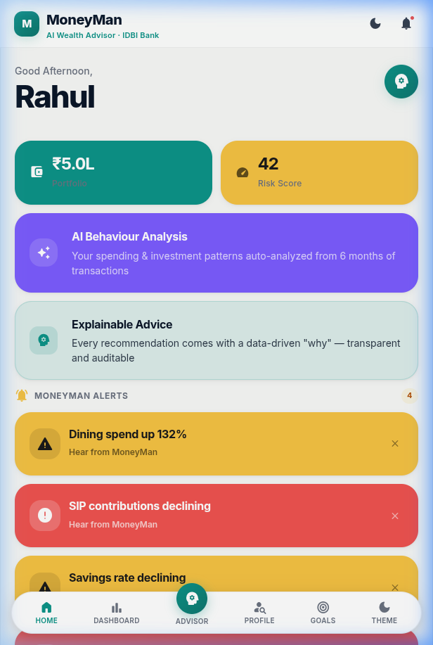
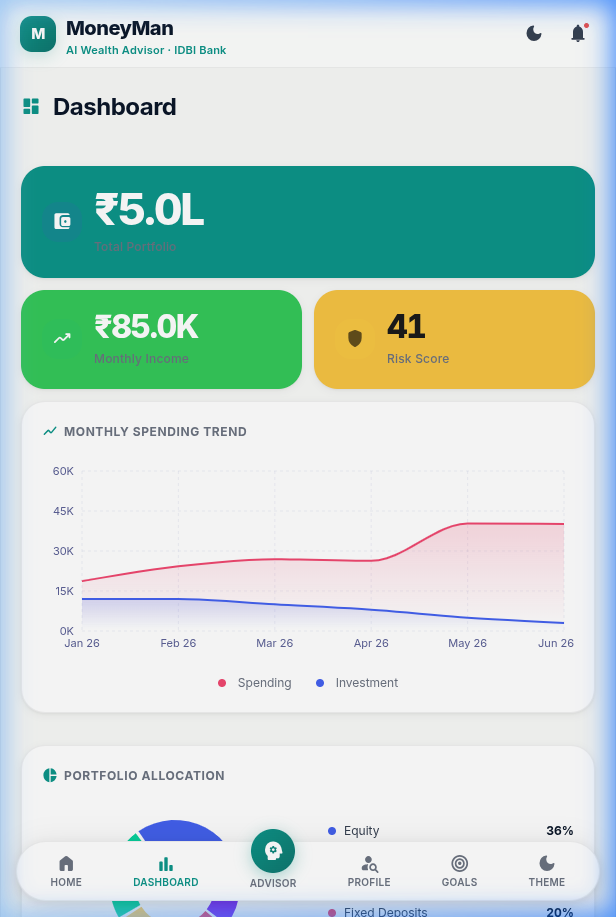
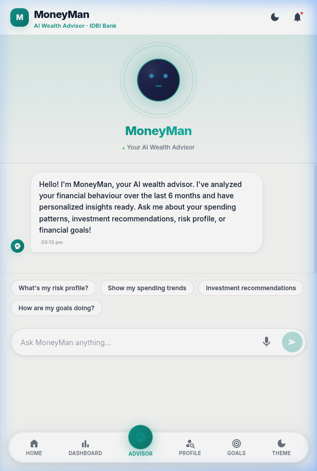
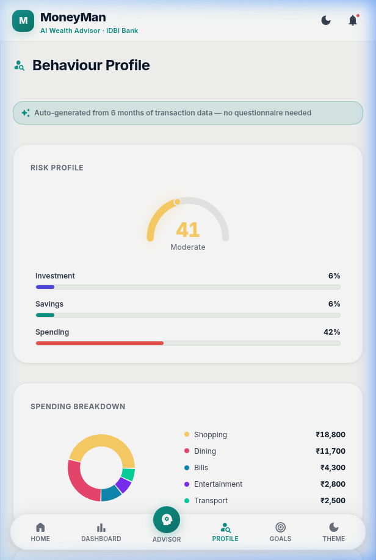
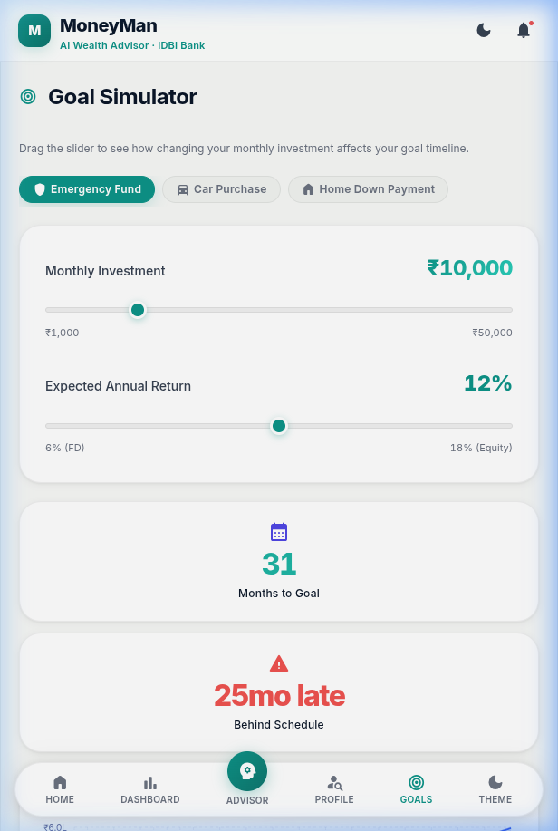

<div align="center">

# MoneyMan

**AI-Powered Digital Wealth Advisory for IDBI Bank**

[](https://github.com/Durgaprasad-Developer/MoneyMan)&nbsp;&nbsp;[](https://github.com/Durgaprasad-Developer/MoneyMan)&nbsp;&nbsp;[](https://moneyman-27st.onrender.com/)&nbsp;&nbsp;[](./LICENSE)

</div>

---

MoneyMan is a plug-and-play AI wealth advisory module designed for IDBI Bank's digital ecosystem. It builds a **Financial Behaviour Twin** from 6 months of transaction history — no questionnaires, no friction. It scores risk, detects anomalies, and delivers proactive, explainable advice through a voice-enabled conversational avatar.

---

## Interface

<table>
  <tr>
    <td width="33%" align="center">
      
      <br/>
      <sub><b>Home</b> · Portfolio + live nudges</sub>
    </td>
    <td width="33%" align="center">
      
      <br/>
      <sub><b>Dashboard</b> · Spending & investment trends</sub>
    </td>
    <td width="33%" align="center">
      
      <br/>
      <sub><b>Advisor</b> · Voice AI avatar (Groq × WebSpeech)</sub>
    </td>
  </tr>
  <tr>
    <td width="33%" align="center">
      
      <br/>
      <sub><b>Profile</b> · Auto-generated risk score</sub>
    </td>
    <td width="33%" align="center">
      
      <br/>
      <sub><b>Goals</b> · What-if goal simulator</sub>
    </td>
    <td width="33%" align="center" valign="middle">
      <br/><br/>
      <b>Live Demo →</b>
      <br/><br/>
      <a href="https://moneyman-27st.onrender.com/">
        
      </a>
      <br/><br/>
      Built for <b>IDBI Innovate 2026</b><br/>Track 01 · Digital Wealth Advisory
      <br/><br/>
    </td>
  </tr>
</table>

---

## How It Works

```
Transaction History (6 months)
        │
        ▼
┌──────────────────────────────┐
│   Behavioural Profiling      │  ← Computes risk score, ratios,
│   Engine  (server/engines/)  │    spend anomalies silently
└──────────────┬───────────────┘
               │
               ▼
┌──────────────────────────────┐
│   Financial Behaviour Twin   │  ← Living data model of the customer
│   (Risk · Ratios · Trends)   │
└──────────────┬───────────────┘
               │
       ┌───────┴────────┐
       ▼                ▼
┌─────────────┐  ┌─────────────────┐
│ Explainable │  │  Proactive Nudge │  ← Every tip has a data trigger
│ Recommenda- │  │  Engine          │    Every alert has a root cause
│ tions       │  └─────────────────┘
└──────┬──────┘
       │
       ▼
┌──────────────────────────────┐
│   Groq LLM  (llama-3.1-8b)  │  ← Profile context injected as
│   + WebSpeech API            │    system prompt; voice I/O free
└──────────────────────────────┘
```

---

## Core Features

**Financial Behaviour Twin**
Silently analyzes 6 months of transaction data to auto-compute risk profile, asset ratios (Investment : Savings : Spending), and spending anomaly alerts. Zero questionnaires.

**Explainable Advisory Engine**
Every recommendation surfaces its trigger — *"SIP reduced 53%, rebalancing advised."* Fully audit-ready for bank compliance.

**Voice-First Conversational Avatar**
Groq Llama-3.1-8B for near-zero latency responses. Browser-native WebSpeech for TTS/STT — zero marginal cost per conversation.

**What-If Goal Simulator**
Drag a slider, watch projected growth and months-to-goal update instantly. Warns when the user falls behind their target.

**Neo-Bento Design System**
Soft-brutalist bento grid, `40px` border radius, `font-weight: 900` for financial legibility, full light/dark mode token system.

---

## Tech Stack

| Layer | Technology |
| :--- | :--- |
| Frontend | React 18 · Vite 5 · Framer Motion |
| Charts | Recharts |
| Voice | Web Speech API (native, zero cost) |
| Backend | Node.js · Express 5 |
| AI | Groq Cloud · `llama-3.1-8b-instant` |
| Styles | Vanilla CSS custom properties |

---

## Local Setup

**Prerequisites:** Node.js v18+

```bash
# 1. Clone
git clone https://github.com/Durgaprasad-Developer/MoneyMan.git
cd MoneyMan

# 2. Install
npm install

# 3. Environment
echo "GROQ_API_KEY=your_key_here" > .env
# Get a free key → https://console.groq.com/

# 4. Run (starts both Express :3002 and Vite :5173)
npm run dev
```

Open [`http://localhost:5173`](http://localhost:5173)

---

## Project Structure

```
├── server/
│   ├── engines/
│   │   ├── profiling.js          # Risk score, ratios, trend computation
│   │   ├── recommendations.js    # Trigger-based explainable advice
│   │   └── nudges.js             # Anomaly detection + goal simulation
│   ├── data/                     # Mock transaction & customer data
│   └── index.js                  # Express API (profile, chat, simulate)
└── src/
    ├── components/               # Dashboard, Chat, Goals, Profile, Nudges
    ├── context/                  # Theme (light/dark) global state
    ├── hooks/                    # API wrapper + speech synthesizer hooks
    ├── utils/                    # Constants, formatters, color tokens
    ├── App.jsx                   # Shell layout + sidebar navigation
    └── index.css                 # Design token system (colors, radii, grids)
```

---

## Deployment

Monolithic service — Express serves the built React frontend in production.

| Setting | Value |
| :--- | :--- |
| Build Command | `npm install && npm run build` |
| Start Command | `node server/index.js` |
| `GROQ_API_KEY` | your Groq key |
| `NODE_ENV` | `production` |

---

<div align="center">

Built for IDBI Innovate Hackathon 2026 · Track 01 · Team MoneyMan

</div>
